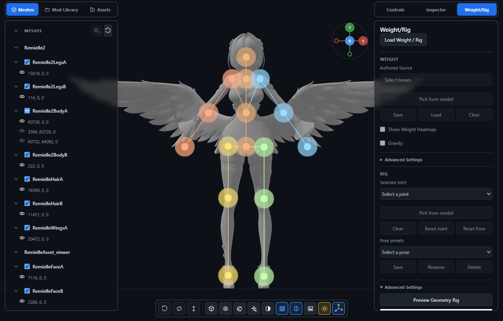
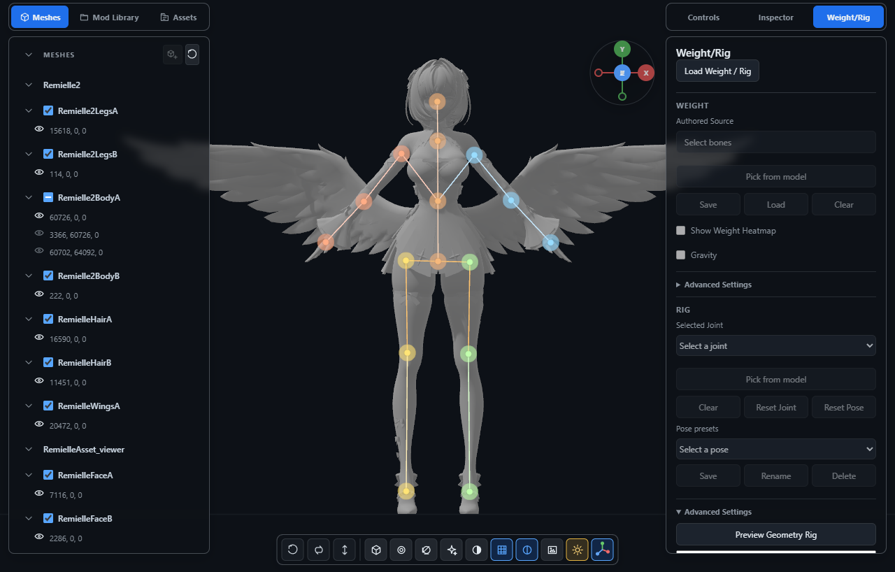
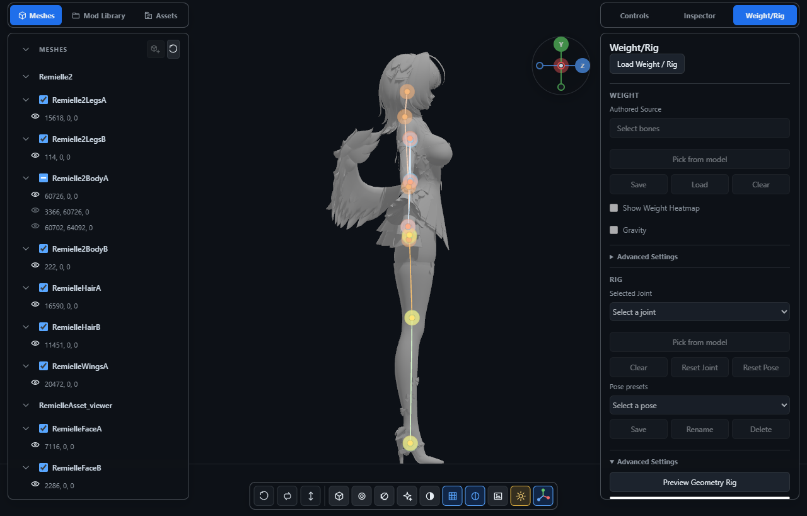
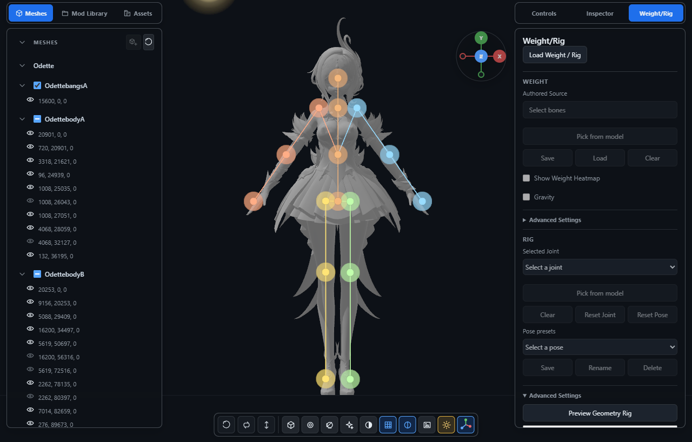
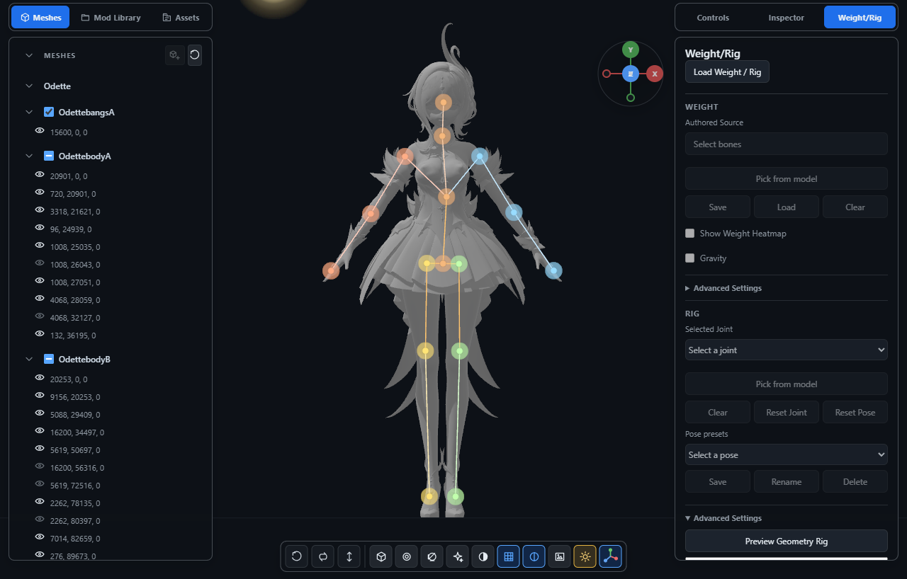
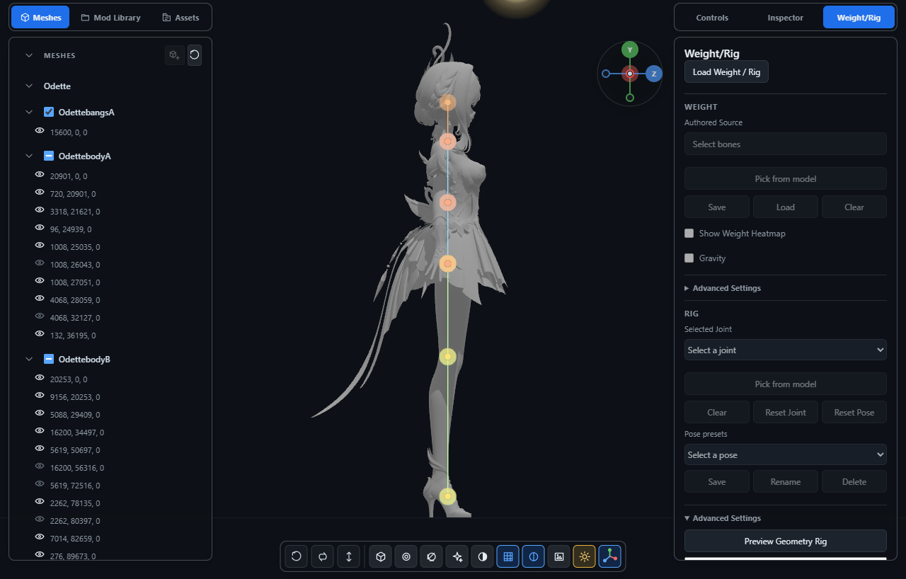
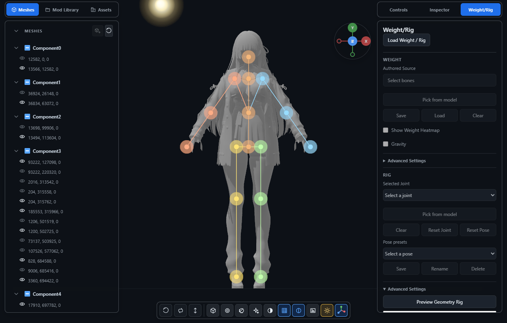
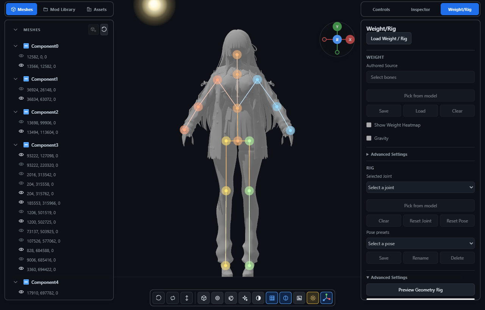
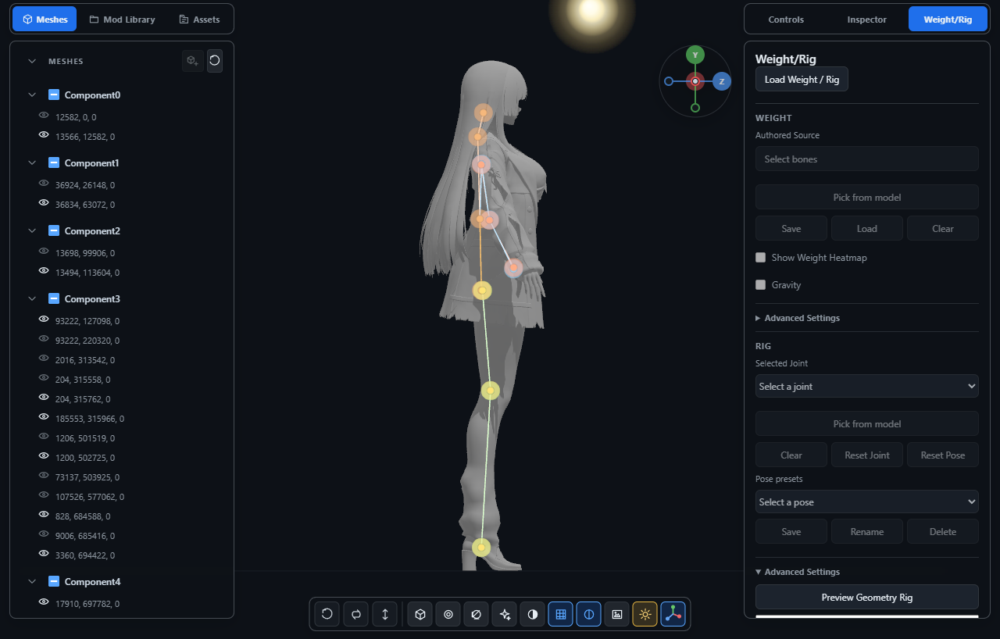

# Geometry rig experiment — Iteration 2

Iteration 2 fixes the lower-face neck placement and removes clothing-taper knee
detection and surface-driven hip widening. Odette's frontal wrist residuals
decrease modestly. Shoulders, elbows, feet, and Chisa's successful wrists retain
their Iteration 1 positions exactly. The result remains a temporary geometry
preview; it does not replace production Rig, binding, deformation, IK, Physics,
Weight, or saved poses. Hidden joint depth is still uncertain.

## Evaluation and uncertainty

The same displayed Remielle, Odette, and Chisa variants are evaluated without
textures or Weight. The [frozen baseline](iteration-1/README.md) was captured
before anatomical fitting changed. The original perspective measurements and
guides are retained as `iteration-1/legacy-measurements.json` and
`iteration-1/legacy-guides.json`; the original six images remain in this folder.
Perspective and orthographic residuals are separate evaluations.

The tool now uses front and left-side orthographic cameras aligned to the
character's right/up/forward axes, with identical height normalization and
camera settling before measurement. The same existing overlay displays the
proportional, Iteration 1, and Iteration 2 positions. Camera direction never
enters the fitter, and no application UI controls were added.

Each of the 16 guide entries classifies **each view** independently:

- **Visible:** an approximate silhouette landmark; front uncertainty is about
  1% of character height and side uncertainty about 1.5%.
- **Estimated:** an anatomical estimate or a broad silhouette envelope,
  useful for plausibility rather than positional accuracy.
- **Indeterminate:** clothing or occlusion prevents a defensible reference.

Only visible guides receive error measurements. Estimated and indeterminate
rows retain null errors. Segment proportions, joint alignment and bilateral
height/depth differences are recorded for plausibility review. The side neck
envelope is broad enough to describe the neck silhouette; it cannot establish
an exact internal spine joint. Confidence means **surface evidence strength**,
not verified anatomical accuracy. The guides were frozen before runtime
algorithm changes and are never inputs to the fitter.

## Measured changes

All numbers are projected distances as percentages of character height.
Triples are **proportional / Iteration 1 / Iteration 2**. Bilateral values are
averages. Small residual changes within guide uncertainty are classified as
stable, rather than proof of improved anatomy.

| Front visible control | Remielle | Odette | Chisa |
| --- | ---: | ---: | ---: |
| Neck | 0.94 / 3.40 / 0.87 | 0.13 / 1.08 / 0.30 | 1.05 / 2.79 / 0.54 |
| Shoulder | 4.61 / 0.85 / 0.85 | 4.96 / 0.80 / 0.80 | 3.29 / 0.48 / 0.48 |
| Wrist/hand | 3.12 / 1.30 / 1.34 | 1.10 / 1.68 / 1.06 | 5.05 / 0.65 / 0.65 |

Neck improvement exceeds frontal guide uncertainty for Remielle and Chisa.
Odette's neck returns near the proportional location, although its original
proportional residual is still smaller. Odette's wrist improvement is below
manual-guide uncertainty, so it is a promising numerical change, not a strong
accuracy claim. Remielle's small wrist residual change is also below that
uncertainty; the controls remain on the forearm and before the hand extremity.

| Side visible control | Remielle I1 → I2 | Odette I1 → I2 | Chisa I1 → I2 |
| --- | ---: | ---: | ---: |
| Near wrist/hand | Indeterminate | 1.28 → 1.31 | 0.25 → 0.25 |
| Near foot | 1.30 → 1.30 | 0.58 → 0.58 | 0.91 → 0.91 |

The small Odette side wrist change is well below side-guide uncertainty. The
former Remielle and Chisa necks lie above the broad side neck envelope; the
updated necks are inside it. No visible-guide regression exceeds uncertainty
in either view. This does not establish hidden hip/knee or occluded-arm depth.

The [measurements](measurements.json) identify improvements, regressions,
stable changes, and uncertainty without comparing rows by hand. Detailed
[Remielle](iteration-2/remielle.json), [Odette](iteration-2/odette.json), and
[Chisa](iteration-2/chisa.json) captures retain all 16 positions in both views,
evidence, individual residuals, and three-dimensional plausibility measures.

## Front and side comparisons

| Model/view | Proportional | Iteration 1 | Iteration 2 |
| --- | --- | --- | --- |
| Remielle front |  |  |  |
| Remielle side |  |  |  |
| Odette front |  |  |  |
| Odette side |  |  |  |
| Chisa front |  |  |  |
| Chisa side |  |  |  |

## Anatomy and remaining limitations

The neck uses the shoulder-to-head relationship and consistent upper-torso
sections in three dimensions. A single narrow face section no longer controls
its height. The wrist uses distal forearm direction, the hand expansion and
anatomical length constraints; it no longer chooses the narrowest sleeve.
Shoulder and arm-path detection are unchanged.

Leg evidence is traced upward from each foot. Only continuous, bounded
three-dimensional sections can refine the hip/knee centerline. Segment
relationships retain plausible joint heights; width taper is never a knee
detector. Hidden hips remain at the proportional estimate on all three models.
The largest knee departures from that estimate are 0.44% of height for Remielle,
0.23% for Odette, and 0.75% for Chisa. These small corrections describe supported
limb alignment, not a measured internal knee. A synthetic skirt with obscured
thighs leaves hip/knee positions at their anatomical estimates.

Remielle's wings do not become hand endpoints. With wings hidden, shoulder
positions exactly match the stored Iteration 1 hidden-accessory fit. Accessory
visibility still changes surface normalization: central height changes by
0.89%, and the largest full-versus-hidden control shift is 2.25% of height.
This existing sampling sensitivity should not be confused with an Iteration 2
arm regression. The [accessory capture](iteration-2/remielle-hidden.json)
records both views and its comparison with the original hidden-accessory fit.

Chisa's 32 inactive meshes remain excluded. Independent duplication of every
displayed mesh causes zero control displacement. Approximately symmetric
height/depth relationships are retained. Exact duplicate draws and triangles
are removed; spatial occupancy mitigates other overlap. Differently triangulated
overlapping surfaces still need not produce identical samples.

## Workload and performance

| Model | Displayed/inactive meshes | Displayed triangles | Deduplicated draw triangles | Examined / unique triangles | Area samples / retained points | I1 → I2 observed fit |
| --- | ---: | ---: | ---: | ---: | ---: | ---: |
| Remielle | 10 / 2 | 45,285 | 45,285 | 45,285 / 45,279 | 16,000 / 15,706 | 0.41 → 0.42 s |
| Odette | 35 / 10 | 75,131 | 72,346 | 72,346 / 72,165 | 16,000 / 15,554 | 0.64 → 0.61 s |
| Chisa | 19 / 32 | 145,749 | 145,749 | 90,000 / 90,000 | 16,000 / 15,619 | 0.76 → 0.70 s |

These sequential observations use the same browser and hardware, with cold
viewer loads. They are illustrative rather than a statistically controlled
benchmark. The 90,000-triangle and 16,000-area-sample caps and cooperative
yielding remain unchanged. Displayed counts include repeated draws; exact-draw
deduplication precedes the scan, triangle deduplication follows it, and spatial
occupancy produces retained fitting points. This reconciles the earlier report's
incorrect use of Odette's displayed count as its examined count.

## Reproduce and review

```text
python tools/evaluate_geometry_rig.py <mod-folder> --output <report-folder> --guides docs/experiments/geometry-rig/<model>-guides.json --baseline docs/experiments/geometry-rig/iteration-1/<model>.json
```

Use `--check-duplicates` for duplication testing and `--hide Wings` for the
accessory comparison. The read-only bridge fixture opens the existing viewer,
captures both views and three skeletons, and writes `comparison.json`. It does
not change mod files or load skinning data. A compatible local WebGPU browser
is required. Hiding geometry changes the normalization frame; compare that
capture with the matching hidden-accessory baseline when interpreting errors.

Static previews use existing pose/edit/Physics ownership state instead of
scanning every live vertex. Animated participants retain a conservative rest
comparison. Pending fits reject changed geometry buffers, draw ranges, rest
arrays, visibility, and transforms. Relevant mesh/transform events clear
completed previews. Results remain temporary, and explicit requests rerun fitting.

Focused coverage checks neck/head/shoulder relationships, wrist alignment,
skirt uncertainty, orientation, topology, duplicates, Weight-free preview,
cancellation, restored controls and model switching. The existing CI quality
audit and unit/core/app/integration selection are unchanged.

Keep PR #180 open for review. The improved neck and conservative lower body
support further investigation, but ambiguous depth and modest wrist evidence
still need review before a separate IK experiment. No binding or deformation
work is introduced here.
