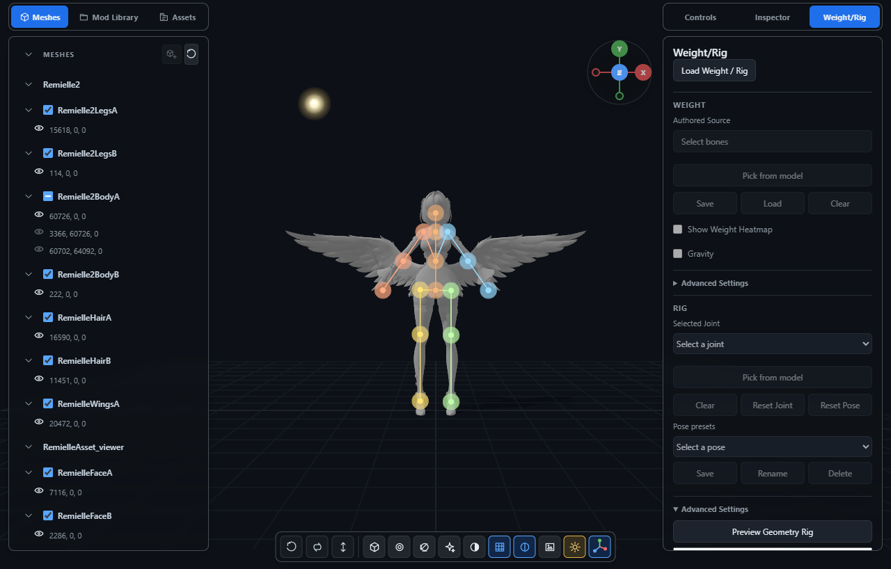
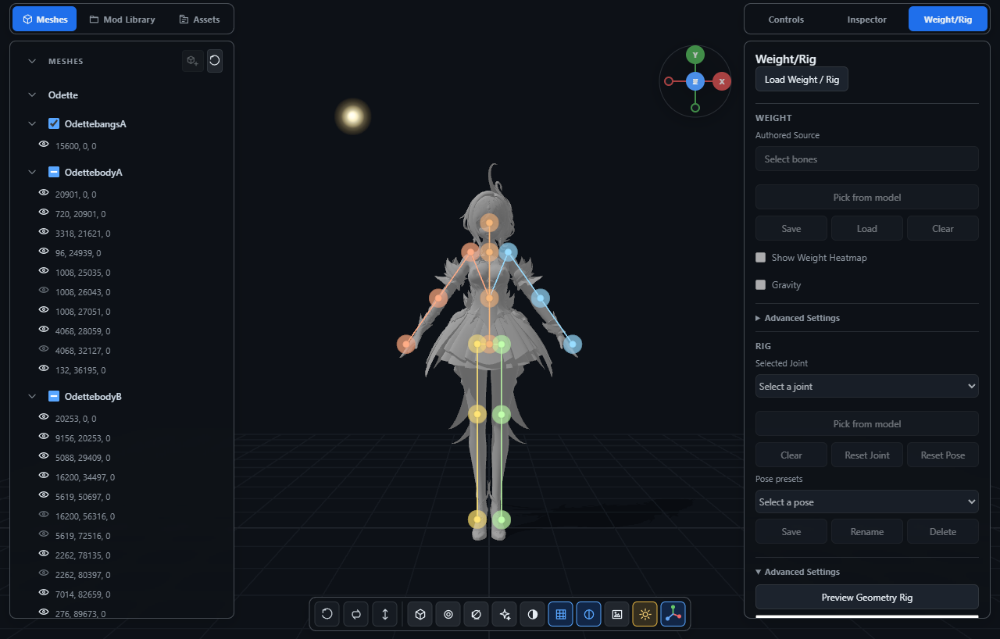
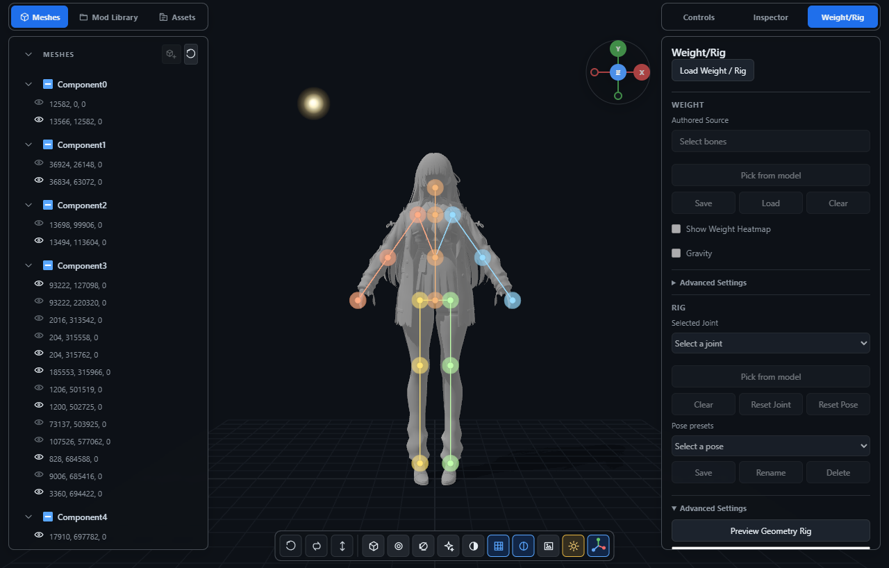

# Geometry rig experiment

The [frozen Iteration 1 baseline](iteration-1/README.md) adds consistent front
and side orthographic captures before anatomical changes for Iteration 2.
It preserves the original perspective guides and measurements separately.

The geometry preview improves shoulder placement on all three evaluated models,
but it is not ready to replace the existing Rig. Wrist, knee, hip, and neck
placement still have consequential failures. The preview remains temporary;
the existing binding, deformation, IK, Weight, Physics, and persistence code
continue to own their original behavior.

## Evaluation method

The evaluation uses the Remielle, Odette, and Chisa mod folders corresponding
to the requested ZZZ, Genshin, and Wuwa examples. The initial control defaults
select the displayed variants. Textures are disabled to make the silhouette
and overlay easier to inspect. No Weight request is made.

Both skeletons use the same displayed surface sample and the unchanged
proportional generator. This isolates anatomical adjustment from changes in
sampling. The **Current Rig** option returns to the loaded production rig,
including its saved controls. Opening the panel now leaves Weight unloaded;
**Load Weight / Rig** explicitly starts the existing activation workflow.

The three `*-guides.json` files contain manually estimated frontal guides for
all 16 controls, expressed relative to projected character height. Visible
guides are approximate silhouette landmarks, with about 3–5 pixels of placement
uncertainty. Hidden torso, hip, and knee guides are anatomical estimates;
they are not ground truth. Errors below are two-dimensional projected distance
as a percentage of character height, averaged over left and right sides.
These figures do not establish depth accuracy. Fit confidence describes available
surface evidence, not independently verified anatomical correctness.

## Before and after

Each cell is **proportional → geometry**, in percent of character height.

| Control | Remielle | Odette | Chisa |
| --- | ---: | ---: | ---: |
| Shoulder | 5.22 → 1.36 | 5.16 → 1.11 | 3.17 → 0.53 |
| Elbow | 2.15 → 1.00 | 3.62 → 1.17 | 0.74 → 0.85 |
| Wrist/hand | 2.83 → 1.29 | 0.67 → 1.33 | 5.11 → 0.45 |
| Hip (estimated) | 1.25 → 1.25 | 1.34 → 1.34 | 1.02 → 1.87 |
| Knee (estimated) | 1.18 → 1.15 | 0.21 → 1.42 | 1.24 → 1.50 |
| Foot | 0.64 → 0.60 | 0.57 → 0.34 | 1.71 → 1.62 |

All 16 individual control errors, confidence levels, and visible/estimated guide
labels are recorded in [measurements.json](measurements.json).

| Model | Proportional overlay | Geometry overlay |
| --- | --- | --- |
| Remielle |  |  |
| Odette |  |  |
| Chisa |  |  |

## Robustness and incorrect placements

- **Remielle:** the arm path remains near the actual arms with wings visible;
  neither hand goes to a wing tip. Hiding the wings keeps shoulders and limbs
  in the same regions. The central-height estimate changes by less than 1%.
  Hair and wings do not pull the torso toward an accessory. Neck fitting is
  too high, and the chest adjustment moves away from its estimated guide.
  Hips remain dominated by anatomical constraints.
- **Odette:** Y-up orientation and the actual downward arm branches are retained.
  Shoulders and elbows improve. The wrist section moves the hand slightly too
  low. Clothing does not establish hidden hip/knee locations; those guides remain
  estimates. The bounded lower-leg profile can misinterpret clothing taper as
  a knee transition, increasing the projected knee error. This is a reason to
  retain the proportional constraint and not promote the experiment.
- **Chisa:** Z-up orientation is retained, and 32 inactive meshes do not enter
  the sample. Duplicating every displayed mesh with independent geometry and
  rest arrays produces zero control displacement. Shoulder and wrist placement
  improve substantially. Elbows change little. Hip width is too large, and the
  neck moves upward into the lower face. Approximate symmetry is preserved.

Duplicate triangle corners and exact duplicated draws are removed before fitting.
Spatial sample occupancy reduces vertex-density and overlapping-surface bias.
Different triangulations of partly overlapping surfaces are not guaranteed to
have identical samples. This is a bounded surface experiment, not mesh repair.

## Workload and performance

| Model | Displayed / inactive meshes | Displayed triangles | Deduplicated draw triangles | Examined triangles | Unique examined triangles | Area samples / retained points | Observed fit time |
| --- | ---: | ---: | ---: | ---: | ---: | ---: | ---: |
| Remielle | 10 / 2 | 45,285 | 45,285 | 45,285 | 45,279 | 16,000 / 15,706 | about 0.4 s |
| Odette | 35 / 10 | 75,131 | 72,346 | 72,346 | 72,165 | 16,000 / 15,554 | about 0.6–0.9 s |
| Chisa | 19 / 32 | 145,749 | 145,749 | 90,000 | 90,000 | 16,000 / 15,619 | about 0.8 s |

Displayed counts include repeated draws; identical draws are removed before
the capped scan. Triangle-corner deduplication follows the scan, and spatial
occupancy reduces the 16,000 area samples to the retained fitting points.
The former report incorrectly used Odette's displayed count as its examined
count; these distinct counters now match the recorded diagnostics.

Timing is illustrative and depends on browser/runtime load. The algorithm caps
triangle analysis at 90,000 and area samples at 16,000, yielding during the
triangle scan and duplicate comparison. The interface remains usable during
fitting. Repeated requests explicitly rerun the analysis. Switching models,
invalidating rest geometry, or cancelling prevents stale results from appearing.
The fitting operation does not use camera state; only the evaluation projection
uses the camera.

## Reproduce the comparison

Run the repository's development Python interpreter with:

```text
python tools/evaluate_geometry_rig.py <mod-folder> --output <report-folder> --guides docs/experiments/geometry-rig/<model>-guides.json
```

Use `--hide Wings` for the Remielle accessory comparison and `--check-duplicates`
for the Chisa duplication check. The tool opens the existing viewer with a
read-only bridge fixture, records control diagnostics and projections in
`comparison.json`, and captures both overlays. It does not modify the mod or
load its skinning data. A compatible local WebGPU browser is required.

Focused synthetic coverage exercises Y-up/Z-up coordinates, the 16-control
topology, deterministic fitting, approximate symmetry, displayed asset fill,
duplicate sampling, workload caps, immutable rest geometry, preview switching,
cancellation, model cleanup, restored controls, and operation without ModelRig.
The existing CI quality audit and non-browser test selection are unchanged.

The next experiment should resolve the neck and clothed-limb ambiguities and
verify depth against independent guides before changing authoritative Rig or
deformation binding.
